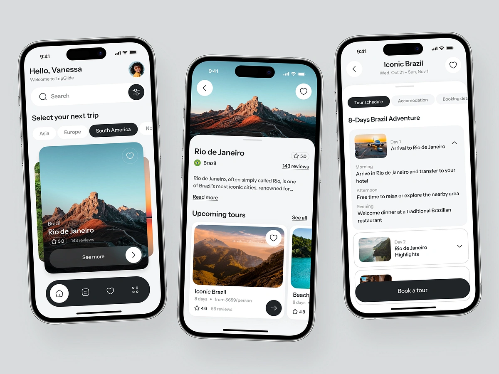

# Travel Glide 🌍

Welcome to **Travel Glide**, a beautifully designed travel app built with [Expo](https://expo.dev) and React Native. This app helps you explore destinations, discover new places, and plan your next adventure.



## 🚀 Features

- **Explore Destinations**: Discover amazing places to visit.
- **Favorites**: Save your favorite destinations for easy access.
- **User-Friendly Interface**: A clean and intuitive design for seamless navigation.

## 🛠️ Installation and Running

### 1. Install Dependencies

Run the following command to install all required dependencies:

```bash
npm install
```

### 2. Start the App

Launch the app using Expo:

```bash
npx expo start
```

In the output, you'll find options to open the app in a:

- [Development build](https://docs.expo.dev/develop/development-builds/introduction/)
- [Android emulator](https://docs.expo.dev/workflow/android-studio-emulator/)
- [iOS simulator](https://docs.expo.dev/workflow/ios-simulator/)
- [Expo Go](https://expo.dev/go), a limited sandbox for trying out app development with Expo.

You can start developing by editing the files inside the **app** directory. This project uses [file-based routing](https://docs.expo.dev/router/introduction).


## 📚 Learn More

To learn more about developing your project with Expo, check out the following resources:

- [Expo documentation](https://docs.expo.dev/): Learn fundamentals or explore advanced topics with [guides](https://docs.expo.dev/guides).
- [Learn Expo tutorial](https://docs.expo.dev/tutorial/introduction/): Follow a step-by-step tutorial to create a project that runs on Android, iOS, and the web.

## 🌐 Join the Community

Join our community of developers creating universal apps:

- [Expo on GitHub](https://github.com/expo/expo): View our open-source platform and contribute.
- [Discord community](https://chat.expo.dev): Chat with Expo users and ask questions.

---

Enjoy exploring with **Travel Glide**! ✨
